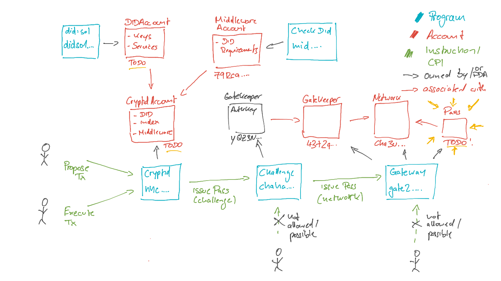

# Identity.com Challenge

We are excited to be at Breakpoint and wanted to take the chance to showcase our technology through a challenge. The reward: a pair of Apple AirPods Max headphones.

But first, an introduction. At [Identity.com](http://identity.com), we provide self-sovereign identity toolkits for developers. These toolkits make managing identity easy, portable, and contextual and give end-users full ownership of their identities.

We offer a full suite of tools covering both off-chain and on-chain use cases. This challenge is designed to cover both elements and show how you can use them in your dApp. It's best to view the tools as lego blocks and put them together in whatever way you need. The showcase below is one example.

Today, we have three core products to show you. Namely, the Gateway Protocol, Cryptid, and did:sol. Below is a brief description of each and links to learn more.

## Gateway Protocol

Makes verified information accessible on-chain in a private and permissionless way.

[GitHub](https://github.com/identity-com/on-chain-identity-gateway)

[Whitepaper](https://github.com/identity-com/gateway-whitepaper/blob/main/gateway-whitepaper.pdf)

## Cryptid

Gives web3 users a wallet abstraction that anchors and links a standardized off-chain identity (DIDs) with an on-chain identity. It also enables programmable logic (called Middleware) when using DIDs and Gateway Passes.

[Learn more](https://github.com/identity-com/cryptid).

## did:sol

Is the official DID method on Solana and offers one identifier for all on and off-chain needs.

[Learn more](https://github.com/identity-com/sol-did).

## Challenge Setup

### Overview



### Description

A pair of brand new Apple Airpod Max's is yours if you can prove that you own an Identity Challenge Gateway Pass issued
by the Gatekeeper Network `cha3u755qh8GbDayALBwA7ZroFT4NHfPUYgERp16M1z` in your wallet.

Some important housekeeping:

- The challenge can only be performed on Solana Devnet.

- The challenge program is deployed at `chahabA9kRqd7kfdHsxSHTvPgwtfYRChf7u2vZtkDYS` which issues a Gateway Pass to a 
  wallet of your choice. However, the Pass issuance must be called by a Cryptid Account that is configured with the 
  predefined Middleware "CheckDID".

- You can find the Challenge Program source code [here](./programs/identity-challenge/src/lib.rs). 
  This is just for your information. You will not need to change or deploy the challenge program yourself.

- This Middleware ("CheckDID") program is deployed at `midb3GKX7wF1minPXeDKqGRKCK9NeR8ns9V8BQUMJDr` and generally verifies 
  that a DID associated with your Cryptid Account meets the given Criteria. (Source code 
  [here](https://github.com/identity-com/cryptid/blob/fix/hh-release/programs/middleware/check_did/src/lib.rs)
  again, just FYI). 

Furthermore, we've deployed a "Configuration" of this middleware at
`79Rca2Uu11RJ6i7fbFQPvm2kbTWEEJnzsm8RmWVGwbnB`. This configuration checks that the given DID has the following
two criteria met:


1. An Ethereum Key as a VerificationMethod of Type `EcdsaSecp256k1RecoveryMethod2020` that also has the following Flags set:
    `BitwiseVerificationMethodFlag.CapabilityInvocation | BitwiseVerificationMethodFlag.OwnershipProof`

    Note: You need at least one VerificationMethod that matches these criteria, so it's also ok to have multiple.

2. Your DID has at least one Service set up with the following data:

```md
serviceType: "profile-pic",

serviceEndpoint: "https://tenor.com/view/vendetta-hats-off-fat-gif-11654529"
```

To solve the challenge, you have to do the following:

1. Setup a DID ("DidAccount") that matches the given criteria. (`@identity.com/sol-did-client` will help here).
2. Setup a CrytidAccount (with an index `> 0`) with the DID from step 1 and the Middleware "CheckDID" with the Middleware
   Account: `79Rca2Uu11RJ6i7fbFQPvm2kbTWEEJnzsm8RmWVGwbnB`.
3. Create a transaction to the `Challenge Program`. This transaction takes the CryptidAccount from (2)
   and a Wallet of your choice that the pass gets issued to.
    ```typescript
      public async issuePass(
        cryptidAccount: PublicKey,
        subject: PublicKey
      )
    ```
4. Since the Challenge Program **can only be called** with a CryptidAccount as a Signer, you need to propose
   and execute the transaction via `Cryptid`.
5. If all your Did matches the State and you execute the transaction correctly via Cryptid, a pass will be issued
   to a wallet of your choice.

Note: the Gateway Protocol comes with a CLI that you can use to verify if you have successfully issued a Pass to your wallet. To install the CLI, run the following command.

```zsh
npm: npm install --global @identity.com/gateway-solana-cli
yarn: yarn global add @identity.com/gateway-solana-cli
```

Then verify that the pass has been issued correctly by running the following command with the correct arguments.

```zsh
gateway pass verify --cluster [clusterType] --subject [address of the account to which a pass has been issued] --network [address for the gatekeeper network]

    --> Pass Verified — Current Pass State: 0
```

Once your Pass has been issued, you may go to claim your prize by doing the following:

1. Reach out to us (contact details provided below). We will need to confirm that you are in control of the wallet with the associated Pass (criteria 1) and chat through how you solved the challenge.

2. We will take you through <https://zerodayshopping.identity.com/> and purchase your prize. To checkout, you will need to connect the wallet that has the correct Pass issued (criteria 2). We will then demo how to perform KYC using the Gateway Protocol (you don't need to bring your ID).

3. Finally, we would appreciate a shoutout on Twitter (@identity) with your new prize! Chat with our community manager, Garet.

If you have any questions or need help please feel free to reach out to us on [Twitter](https://twitter.com/identity) or [Discord](https://discord.io/identitycom), or come find us at the Lisbon Hacker House!
